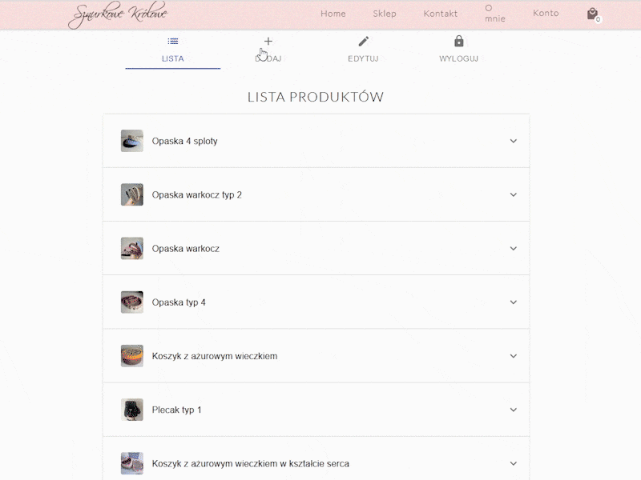

# HANDMADE STORE

## About The Project - [Live Demo](https://brozinsky.github.io/handmade-store/)

A simple e-commerce static website. 
App has a cart to add/remove items, it shows the total price and sends user to checkout.
It also includes admin-only features like adding and removing products.
Loading of products made with GraphQL, data storage using Heroku and Hasura. 
Routes implemented with React router, including seamlessly moving between pages. 
Styling made with Sass with the use of Material UI elements. Website design made in Figma.

#### Features

* Add and remove products from the cart
* Filter products by choosing different tabs 
* Responsive design

#### Admin only features

* Remove products from website
* All product overview list with options to delete and edit
* Create product using form

### Admin Product List

### Admin Product Creation

### Built With

* Main technology - [React](https://reactjs.org/), state managed with hooks
* Styling made using [Sass](https://sass-lang.com/)
* Queries and mutations made with [GraphQL](https://graphql.org/)  
* Data stored using [Heroku](https://www.heroku.com/) and [Hasura](https://hasura.io/) 
* Authentication and product images stored in [Firebase](https://firebase.google.com/)
* Used [Material-UI](https://material-ui.com/) components
* Routing made with [React-Router](https://github.com/ReactTraining/react-router)
* Design in [Figma](https://www.figma.com/)

## Getting Started

This project was bootstrapped with [Create React App](https://github.com/facebook/create-react-app).

### Available Scripts

To get a local copy up and runningTo get a local copy up and running, in the project directory, you can run:

#### `npm start`

Runs the app in the development mode. 
Open [http://localhost:3000](http://localhost:3000) to view it in the browser.

The page will reload if you make edits. 
You will also see any lint errors in the console.

### Learn More

You can learn more in the [Create React App documentation](https://facebook.github.io/create-react-app/docs/getting-started).

To learn React, check out the [React documentation](https://reactjs.org/).
